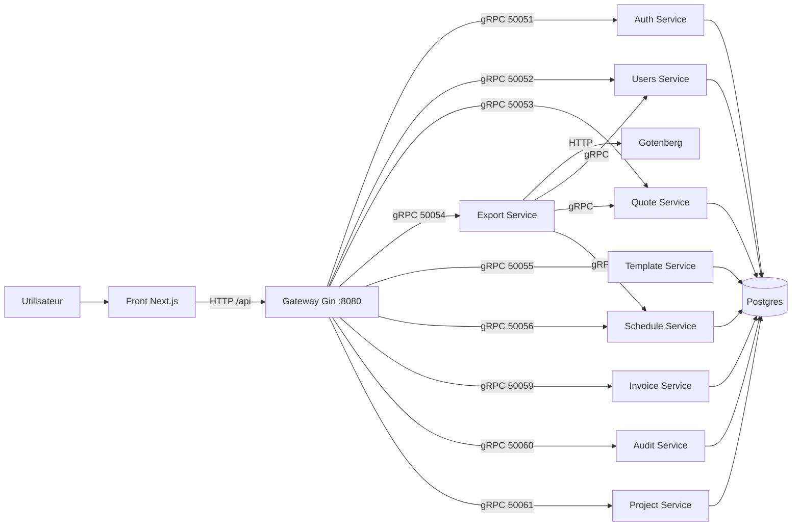

# Architecture Overview

Ce document décrit l'architecture technique actuelle de project-devis.

## Objectif

Le projet implémente une architecture microservices orientée domaine:

- Frontend Next.js (App Router)
- Gateway HTTP (Gin) qui expose l'API REST
- Services metier gRPC (auth, users, quote, template, schedule, export, invoice, audit, project)
- Postgres mutualise (1 cluster, plusieurs bases)
- Gotenberg pour la generation PDF

## Vue logique

## Orchestration

Deux orchestrations Docker Compose coexistent:

- Developpement local: `backend/docker-compose.yml`
- Production: `docker-compose.prod.yml`

En local, la stack inclut `devis-template` et `TEMPLATE_SERVICE_ADDRESS`.
En production actuelle, `devis-template` n'est pas encore deployee.

Le service `schedule` est defini comme prochaine brique metier dediee pour les echeanciers. Sa documentation cible est decrite dans `docs/services/schedule.md`.

## Pattern backend commun

Chaque service Go suit globalement le meme pattern:

1. bootstrap dans `main.go`
2. connexion DB (si service persistant)
3. execution des migrations embed
4. demarrage serveur gRPC sur un port dedie
5. logique RPC dans `actions/`

Le gateway applique le pattern inverse:

1. exposition de routes HTTP sous `/api`
2. authentification JWT en middleware
3. delegation vers clients gRPC
4. mapping de codes metier vers statuts HTTP

## Persistence et migrations

- Les services `auth`, `users`, `quote`, `template` possedent chacun leurs migrations.
- Le futur service `schedule` suivra le meme modele avec une base dediee et des migrations embarquees.
- Les migrations sont lancees au demarrage du service.
- Le volume Postgres est persistant et ne doit pas etre supprime hors reset volontaire.

Voir aussi: `backend/README.md`, `docs/DEPLOY.md`.

## Risques connus (a traiter en fin de phase)

Les points suivants sont identifies et assumes temporairement:

- APP_KEY non explicite dans les compose principaux.
- Cookie secure base sur `ENV=production` alors que la variable n'est pas injectee partout.
- Service template absent du compose production.
- Incoherences ponctuelles de code d'erreur HTTP sur certains handlers auth.

## Conventions d'API

- Reponse standard: `success`, `message`, `code` (selon endpoint)
- Auth principale via cookies HTTP-only (`access_token`, `refresh_token`)
- Le front implemente un mecanisme de refresh/retry automatique sur 401

## Cartographie des dossiers

- `front/`: client web Next.js
- `backend/gateway/`: facade HTTP + middleware auth
- `backend/auth/`: authentification, JWT, refresh tokens
- `backend/users/`: profil utilisateur, clients, adresses, taxes
- `backend/quote/`: devis et lignes de devis
- `backend/template/`: templates et lignes de template
- `backend/schedule/`: echeanciers de facturation et grille mensuelle associee
- `backend/export/`: generation PDF via Gotenberg
- `backend/invoice/`: factures et avoirs (port 50059)
- `backend/audit/`: journal d'activite admin (port 50060)
- `backend/project/`: regroupement metier de devis en projets (port 50061)
- `docs/`: documentation technique et exploitation
