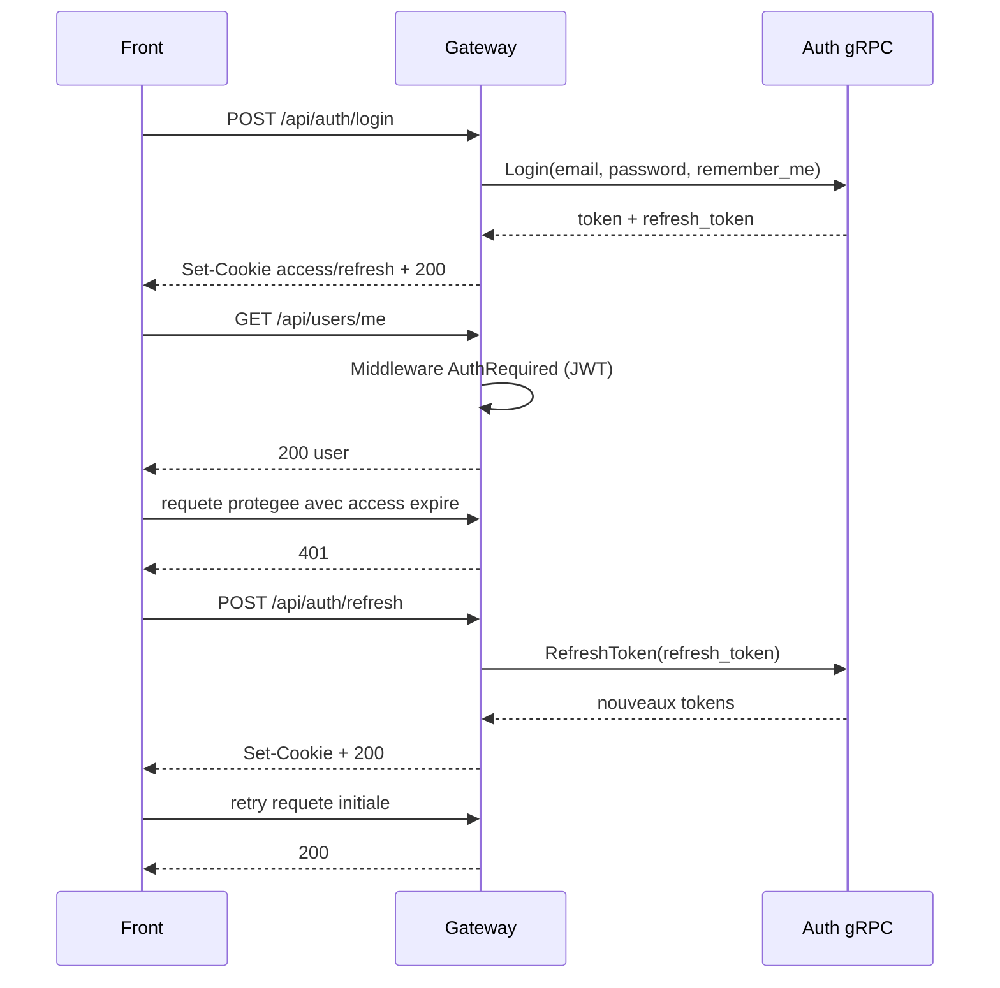
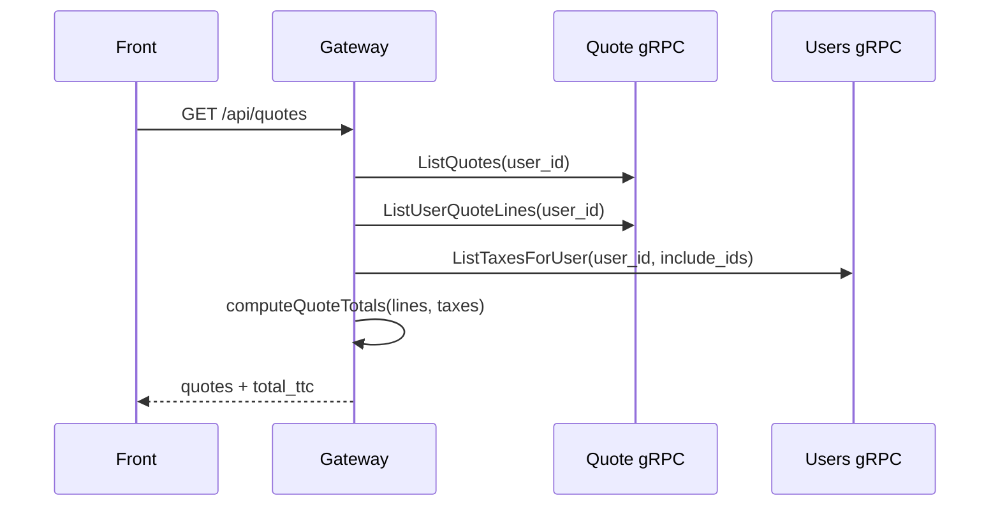
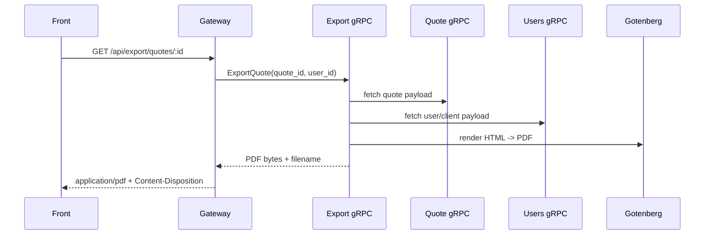
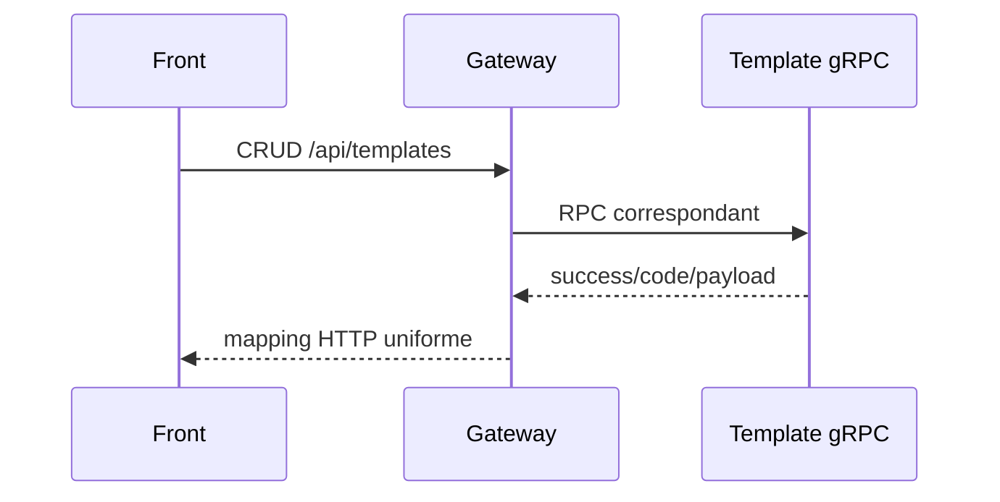

# Runtime Flows

Ce document detaille les flux d'execution applicatifs les plus importants.

## 1) Authentification et session

Notes:

- Le front coalesce les 401 concurrents via une promesse unique de refresh.
- Certaines routes auth sont exclues de la boucle refresh/retry.

## 2) Consultation des devis

Notes:

- Le gateway calcule les totaux TTC agreges pour la liste.
- Les taxes sont chargees avec `include_ids` pour couvrir les references historiques.

## 3) Export PDF d'un devis

Notes:

- Les tailles max gRPC sont alignees a 8 MiB entre gateway et export.
- Un deny-list Chromium est configure cote Gotenberg (mitigation SSRF).

## 4) Gestion des templates

Notes:

- Le flux est actif en local.
- Le service template n'est pas encore inclus dans la stack production actuelle.

## 5) Demarrage des services avec migrations

1. Le conteneur du service demarre.
2. Connexion DB.
3. Execution des migrations embed (`//go:embed migrations`).
4. Ecoute gRPC sur port dedie.

Ce pattern est applique par `auth`, `users`, `quote`, `template`.
